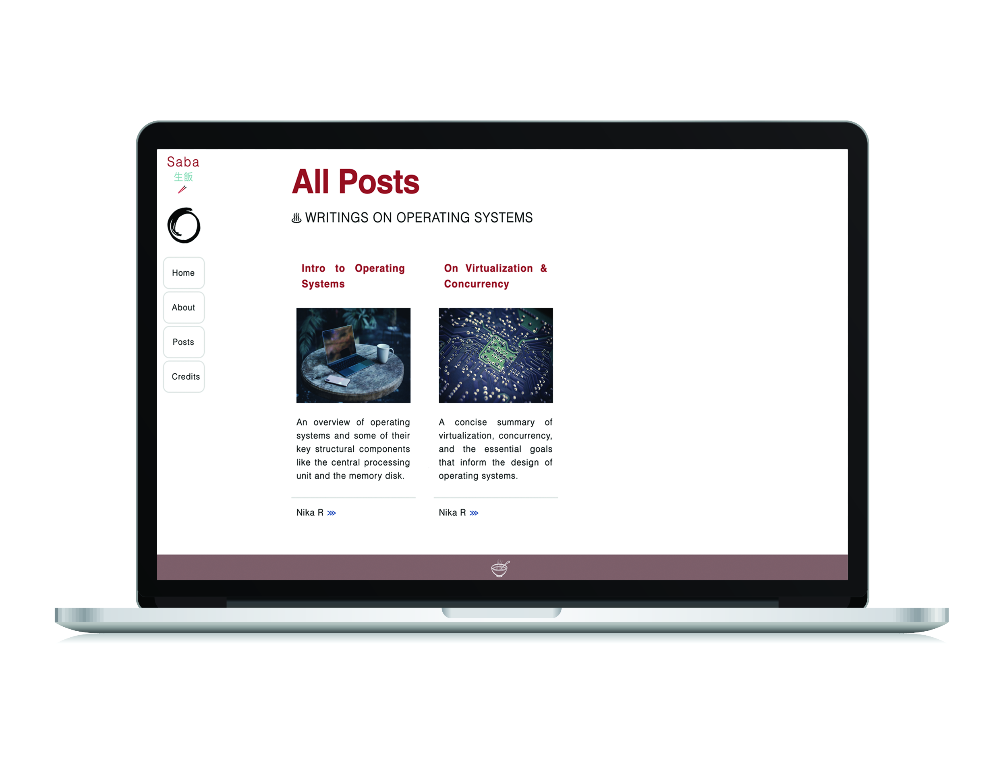

 
<h1>Saba: Web Application</h1>
 <i>Saba</i> 生飯 The few grains of rice offered at the beginning of meals to the hungry ghosts. Written with CSS and HTML.
Supports blog posts. Intended for use as a blog on the basics of operating systems and their design. 

  
<h2>Credits</h2> 
 
Colors generated with <a href="https://coolors.co/1f0318-9c2f30-e5f2c9-8c705f-1e1a1d">Coolors.co</a>. Icons and image used with licenses from <a href="https://www.shutterstock.com/">Shutterstock</a>. Some html code (example: css scrollbar for all/most browsers) from the invaluable <a href="https://www.w3schools.com/"> W3 Schools</a>. 
Name and definition of <i>Saba</i> from this list of words <a href="https://terebess.hu/zen/szoto/szotar/szotar.html">here</a>.
Also, <a href="https://stackoverflow.com/questions/826782/how-to-disable-text-selection-highlighting">this</a> stack overflow question helped with disabling highlighting on webpages.

<h2>Some Colors</h2>

-  `#9c2f30`
-  `#1E1A1D`
-  `#847996`
-  `#DDC8C4`
-  `#1F0318`
-  `#896A67`
-  `#D3B99F`
-  `#88B7B5`
-  `#5e556d`

